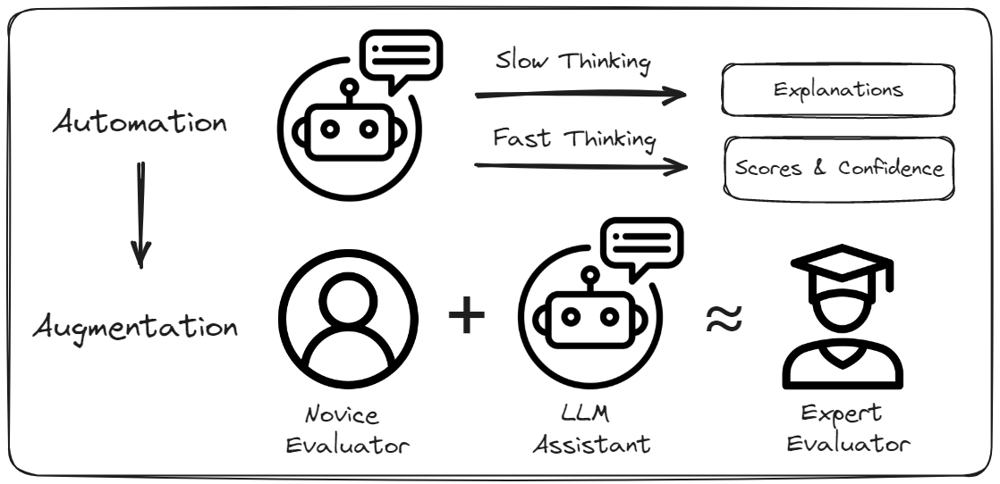

# Human-AI Collaborative Essay Scoring: A Dual-Process Framework with LLMs


This repository contains the codes for the paper [Human-AI Collaborative Essay Scoring: A Dual-Process Framework with LLMs](https://dl.acm.org/doi/10.1145/3706468.3706507). 

The Chinese Student English Essay (CSEE) Dataset used in this paper is publicly available in Huggingface Datasets: [CSEE](https://huggingface.co/datasets/Xiaochr/Chinese-Student-English-Essay). 


# Overview


In this study, we explore the potential of proprietary and open-source LLMs such as **GPT-3.5, GPT-4, and LLaMA3** for **Automated Essay Scoring (AES)**. We conducted extensive experiments with public ASAP dataset as well as a private collection of student essays to assess the zero-shot and few-shot performance of these models. Additionally, we enhanced their effectiveness through supervised fine-tuning (SFT). Drawing inspiration from the **dual-process theory**, we developed an AES system based on LLaMA3 that matches the grading accuracy and feedback quality of fine-tuned LLaMA3. 

Our **human-LLM co-grading experiment** further revealed that this system significantly improves the performance and efficiency of both novice and expert graders, offering valuable insights into the educational impacts and potential for effective human-AI collaboration.



# Contributions

- **LLMs in AES**: We pioneer the exploration of LLMs' capabilities as AES systems, especially in complex scenarios featuring tailored grading criteria. Leveraging dual-process theory, our novel AES framework demonstrates **remarkable accuracy, efficiency, and explainability**.

- **Dataset**: We introduce an extensive essay-scoring dataset, which includes **13,372 essays** written by Chinese high school students. These essays are evaluated with multi-dimensional scores by expert educators. 

- **Human-AI Collaboration**: Our findings from the human-LLM co-grading task highlight **the potential of LLM-generated feedback to elevate the proficiency of individuals with limited domain expertise to a level akin to that of experts**. Additionally, it enhances the efficiency and robustness of human graders by integrating model confidence scores and explanations. These insights set the stage for future investigation into human-AI collaboration and AI-assisted learning within educational contexts. 


# Recommended Reference

If you find our work useful, please consider citing:

```
@inproceedings{10.1145/3706468.3706507,
author = {Xiao, Changrong and Ma, Wenxing and Song, Qingping and Xu, Sean Xin and Zhang, Kunpeng and Wang, Yufang and Fu, Qi},
title = {Human-AI Collaborative Essay Scoring: A Dual-Process Framework with LLMs},
year = {2025},
isbn = {9798400707018},
publisher = {Association for Computing Machinery},
address = {New York, NY, USA},
url = {https://doi.org/10.1145/3706468.3706507},
doi = {10.1145/3706468.3706507},
booktitle = {Proceedings of the 15th International Learning Analytics and Knowledge Conference},
pages = {293–305},
numpages = {13},
keywords = {LLM Application, Automatic Essay Scoring, AI-assisted Learning},
location = {
},
series = {LAK '25}
}
```


